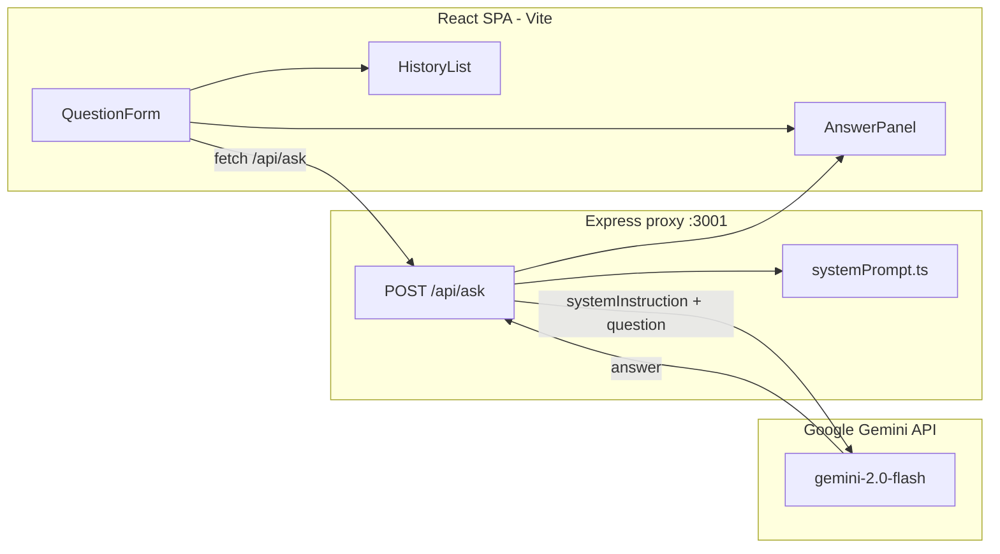

# План: AI-дашборд для продуктовой команды

## Ваши решения

| Вопрос | Выбор |
|--------|-------|
| LLM | **Google Gemini** (gemini-2.0-flash) |
| Архитектура | **React SPA + Express-прокси** |
| Специализация | **Продуктовая команда** |
| Объём | **Только базовый функционал** |

## Gemini API — бесплатно или нет?

**Да, для конкурса можно обойтись бесплатно.**

- API-ключ получается в [Google AI Studio](https://aistudio.google.com/apikey) — **без привязки карты**
- Есть **бесплатный tier** с лимитами на запросы в минуту / в день (достаточно для демо и тестов)
- Модель **`gemini-2.0-flash`** — быстрая, качественная, подходит для продуктовых вопросов
- Точные лимиты: [ai.google.dev/pricing](https://ai.google.dev/pricing) (могут меняться)

**Рекомендация для конкурса:** `gemini-2.0-flash` — бесплатно, быстро, хорошо понимает русский.

---

## Цель

Мини-дашборд по [ai-developer-brief.txt](ai-developer-brief.txt):

- Поле ввода + кнопка «Спросить AI»
- Красивый ответ (markdown)
- История 5 последних запросов
- Кнопка «Копировать ответ»
- Бонус +10: реальная LLM + system prompt + обработка ошибок

Репозиторий сейчас содержит только бриф — проект создаём с нуля.

---

## Архитектура



**Почему прокси, а не прямой вызов из браузера:**

- API-ключ остаётся в `.env`, не попадает в бандл
- Нет CORS-проблем
- Соответствует best practice (важно для видео-презентации)

---

## Стек

| Слой | Технология |
|------|------------|
| Frontend | React 18 + TypeScript + Vite |
| Стили | CSS Modules (без Tailwind — меньше настройки) |
| Markdown | `react-markdown` |
| Backend | Express + `@google/generative-ai` SDK |
| История | `localStorage` (max 5) |
| Запуск | `concurrently` — Vite (:5173) + Express (:3001) |

---

## Структура проекта

```
dashboard_ai/
├── .env.example                    # GEMINI_API_KEY=
├── .gitignore
├── package.json
├── vite.config.ts                  # proxy /api → http://localhost:3001
├── server/
│   ├── index.ts                    # POST /api/ask
│   └── prompts/
│       └── systemPrompt.ts         # продуктовая специализация (используется на сервере)
├── src/
│   ├── main.tsx
│   ├── App.tsx
│   ├── App.module.css
│   ├── api/
│   │   └── askAi.ts                # fetch('/api/ask', { question })
│   ├── components/
│   │   ├── QuestionForm.tsx
│   │   ├── AnswerPanel.tsx         # markdown + «Копировать ответ»
│   │   ├── HistoryList.tsx         # 5 последних, клик = подставить вопрос
│   │   ├── ErrorBanner.tsx
│   │   └── LoadingState.tsx
│   ├── hooks/
│   │   └── useHistory.ts           # localStorage CRUD
│   └── types/
│       └── index.ts
└── README.md                       # запуск + материал для видео
```

---

## System prompt — продуктовая команда (бонус +10)

Файл `server/prompts/systemPrompt.ts` — ассистент **не generic ChatGPT**:

```typescript
export const SYSTEM_PROMPT = `Ты — AI-ассистент продуктовой команды.

Твоя роль: помогать PM, дизайнерам и разработчикам быстро получать практичную информацию о продукте, фичах, приоритетах и метриках.

Правила ответов:
- Начинай с краткого вывода (1–2 предложения)
- Структурируй ответ в markdown: заголовки, списки, таблицы где уместно
- Давай actionable рекомендации, а не общие советы
- При вопросах о приоритизации — предлагай фреймворк (RICE, ICE, MoSCoW)
- При вопросах о метриках — называй конкретные KPI
- Если контекста недостаточно — задай 1 уточняющий вопрос
- Отвечай на языке вопроса (русский по умолчанию)
- Не выдумывай данные о конкретном продукте, которых нет в вопросе`;
```

Промпт передаётся через `systemInstruction` при инициализации модели Gemini.

---

## Backend: `server/index.ts`

**Эндпоинт:** `POST /api/ask`

```typescript
// Тело запроса
{ "question": "Как приоритизировать фичи в спринте?" }

// Ответ
{ "answer": "..." }

// Ошибка
{ "error": "Понятное сообщение на русском" }
```

**Логика:**

1. Валидация: пустой `question` → 400
2. Инициализация `GoogleGenerativeAI` с `GEMINI_API_KEY`
3. Модель `gemini-2.0-flash` с `systemInstruction: SYSTEM_PROMPT`
4. Вызов `model.generateContent(question)`
5. `generationConfig`: `temperature: 0.7`, `maxOutputTokens: 1500`

**Пример вызова:**

```typescript
import { GoogleGenerativeAI } from '@google/generative-ai';
import { SYSTEM_PROMPT } from './prompts/systemPrompt.js';

const genAI = new GoogleGenerativeAI(process.env.GEMINI_API_KEY!);
const model = genAI.getGenerativeModel({
  model: 'gemini-2.0-flash',
  systemInstruction: SYSTEM_PROMPT,
  generationConfig: { temperature: 0.7, maxOutputTokens: 1500 },
});

const result = await model.generateContent(question);
const answer = result.response.text();
```

**Обработка ошибок (обязательно по критериям):**

| Ситуация | Ответ клиенту |
|----------|---------------|
| 400 (пустой вопрос) | «Введите вопрос» |
| 401 / API_KEY_INVALID | «Неверный API-ключ Gemini» |
| 429 / RESOURCE_EXHAUSTED | «Слишком много запросов, подождите» |
| 403 / PERMISSION_DENIED | «Доступ к API запрещён, проверьте ключ» |
| Таймаут / сеть | «Не удалось связаться с AI, попробуйте снова» |
| Пустой ответ модели | «Модель вернула пустой ответ» |

---

## Frontend: компоненты

### `QuestionForm`

- Textarea с placeholder: «Например: какие метрики отслеживать при запуске фичи?»
- Кнопка «Спросить AI» — disabled во время загрузки
- Валидация пустого ввода на клиенте

### `AnswerPanel`

- Рендер через `react-markdown` (заголовки, списки, жирный текст)
- Кнопка «Копировать ответ» → `navigator.clipboard.writeText`
- Feedback «Скопировано!» на 2 секунды

### `HistoryList`

- 5 последних `{ question, answer, timestamp }` из `localStorage`
- Новые сверху, старые вытесняются
- Клик по элементу — подставляет вопрос в textarea

### `ErrorBanner` + `LoadingState`

- Спиннер / skeleton при ожидании
- Баннер ошибки с кнопкой «Повторить»

### Layout

```
┌──────────────────────────────────────────────────────┐
│  AI-ассистент продуктовой команды                    │
├────────────────────────────┬─────────────────────────┤
│  [textarea]                │  История (5)            │
│  [ Спросить AI ]           │  • вопрос 1             │
│                            │  • вопрос 2             │
│  ┌─ Ответ ──────────────┐  │  • ...                  │
│  │ markdown              │  │                         │
│  │ [ Копировать ответ ]  │  │                         │
│  └───────────────────────┘  │                         │
└────────────────────────────┴─────────────────────────┘
```

---

## Порядок реализации (~2 часа)

### Фаза 1 — Скелет (20 мин)

- [x] `npm create vite@latest . -- --template react-ts`
- [x] Установить: `@google/generative-ai`, `express`, `cors`, `dotenv`, `react-markdown`, `concurrently`
- [x] `vite.config.ts`: proxy `/api` → `localhost:3001`
- [x] `.env.example`, `.gitignore`, npm-скрипты `dev` / `dev:server`

### Фаза 2 — Backend (20 мин)

- [x] `server/index.ts` с `/api/ask`
- [x] `server/prompts/systemPrompt.ts` для продуктовой команды
- [x] Интеграция Gemini SDK с `systemInstruction`
- [x] Обработка всех типов ошибок

### Фаза 3 — Frontend core (35 мин)

- [ ] `askAi.ts`, `QuestionForm`, `AnswerPanel`, loading/error states
- [ ] Кнопка копирования

### Фаза 4 — История + UI (30 мин)

- [ ] `useHistory` hook + `HistoryList`
- [ ] CSS Modules: аккуратный светлый дашборд, адаптив

### Фаза 5 — Проверка + README (15 мин)

- [ ] Тест: пустой ввод, 5+ запросов, copy, ошибка (неверный ключ)
- [ ] README: как получить Gemini API key, как запустить, архитектура

---

## Что НЕ делаем (выбор 4A)

- Streaming ответов
- Тёмная тема / сложный дизайн
- Аутентификация, БД, деплой
- Любые бонус-фичи сверх базы

---

## Подготовка Gemini (до кодинга)

1. Зайти на [aistudio.google.com/apikey](https://aistudio.google.com/apikey)
2. Войти через Google-аккаунт
3. Нажать «Create API key» (бесплатно, карта не нужна)
4. Скопировать ключ в `.env`:

   ```
   GEMINI_API_KEY=AIza...
   ```

---

## Скрипт для видео (3–5 мин)

1. **Демо (1 мин):** продуктовый вопрос → структурированный ответ → история → копирование
2. **Стек (30 сек):** React + Vite + Express, почему не Next.js (таймбокс 2ч)
3. **LLM (1 мин):** Gemini 2.0 Flash, system prompt для продуктовой команды, не «голый API»
4. **Архитектура (1 мин):** прокси скрывает ключ, обработка ошибок
5. **Стоимость (30 сек):** Gemini API бесплатный для демо, без привязки карты
6. **Что бы добавил (30 сек):** streaming, метрики использования, деплой
